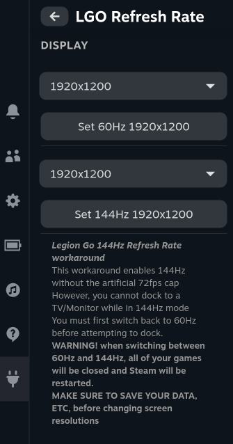

# Legion Go Refresh Rate - Decky Plugin



Decky Plugin workaround for 144hz on the Lenovo Legion Go

This plugin needs more testing, please report any observed issues or problems.

If you need to manually revert the changes made by this plugin, you can do so by deleting the `$HOME/.config/environment.d/override-gamescopecmd.conf` file, this file is the only file that this plugin creates.

- only tested on Nobara v39 so far

# WARNING! READ THIS

This plugin enables 144hz without the artificial 72 fps cap bug

However, this means you **cannot** dock the device to a TV/Monitor on 144Hz

The only way to dock to a TV/Monitor is to go back to 60Hz first.

When switching between 60Hz and 144Hz, all your open games will be closed, and Steam will restart.

Make sure you save your data first before swapping refresh rates!

# Install Instructions

### Prerequisites

Decky Loader must already be installed.

Note that after the initial install, it may take a few attempts or reboots for it to start working.

### Quick Install / Update

Run the following in terminal, then reboot. Note that this works both for installing or updating the plugin

```
curl -L https://github.com/aarron-lee/LegionGoRefreshRate/raw/main/install.sh | sh
```

# Disclaimer

this workaround has not been heavily tested yet, so please be aware that you may encounter bugs
